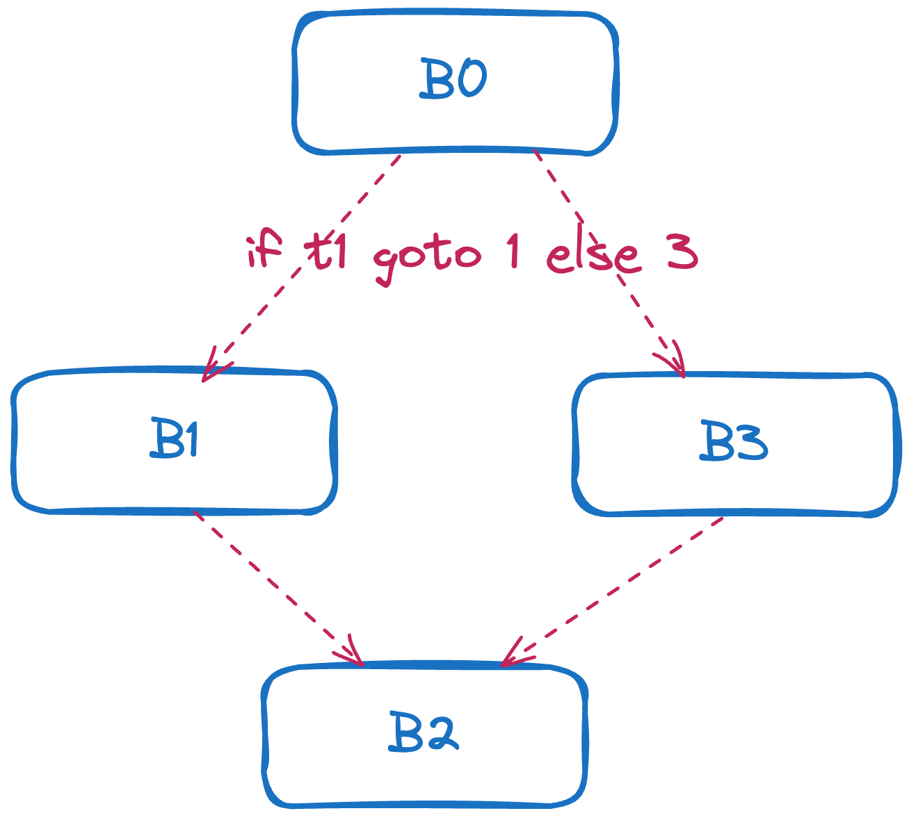

# Blocks and Instructions

Blocks and [instructions](https://pkg.go.dev/golang.org/x/tools/go/ssa#Instruction) are two important concepts in SSA. Instruction is a one-one mapping with
the operations mentioned in specification, such as assignment, arithmetic/logical operation,
function call and so forth. 

<!-- some instructions are values as well -->

All instructions are all contained inside the function bodies. The instructions used to initialize
global functions will be put inside the _package synthesize initializer_.

Instead of holding instructions directly, SSA function holds several blocks in field `Blocks` to 
split the instructions into different logic parts.

```go
package ssa

type Function struct {
	// many fields of Function is removed for better presentation here, added by the author
    
	// These fields are populated only when the function body is built:
	Blocks    []*BasicBlock // basic blocks of the function; nil => external
	Recover   *BasicBlock   // optional; control transfers here after recovered panic
}

type BasicBlock struct {
	Index        int            // index of this block within Parent().Blocks
	Comment      string         // optional label; no semantic significance
	parent       *Function      // parent function
	Instrs       []Instruction  // instructions in order
	Preds, Succs []*BasicBlock  // predecessors and successors
	succs2       [2]*BasicBlock // initial space for Succs
	dom          domInfo        // dominator tree info
	gaps         int            // number of nil Instrs (transient)
	rundefers    int            // number of rundefers (transient)
}
```

SSA function arranges its instructions into different blocks for the control flow, which provides
the functionality to transfer control such as _If_, _Jump_, _Return_ and _Panic_. By this mean,
treat several instructions together as a basic block(unit) for control flow is quite intuitive.

We can use the following code to see the SSA representation of a function body.

```go
package main

import (
	"os"

	"golang.org/x/tools/go/packages"
	"golang.org/x/tools/go/ssa"
	"golang.org/x/tools/go/ssa/ssautil"
)

func load() (*ssa.Program, []*ssa.Package) {
	cfg := &packages.Config{
		Mode: packages.LoadAllSyntax | packages.NeedExportsFile | packages.LoadFiles,
	}
	pkgs, err := packages.Load(cfg, "./testdata")
	if err != nil {
		panic(-1)
	}
	program, spkgs := ssautil.Packages(pkgs, ssa.SanityCheckFunctions)
	program.Build()
	return program, spkgs
}

func main() {
	_, spkgs := load()
	spkgs[0].Func("main").WriteTo(os.Stdout)
}
```

=== "Simple Code Without Control Flow"
    ```go
    package testdata

    func mul(a int) int {
        return 2 * a
    }

    func main() {
        var a int
        a = 1
        a = mul(a)
    }
    ```
    The SSA representation looks like this:
    ```
    # Name: github.com/xieyuschen/go-example/testdata.main
    # Package: github.com/xieyuschen/go-example/testdata
    # Location: /Users/yuchen.xie/workspace/ssa-example/testdata/demo.go:7:6
    func main():
    0:                                                                entry P:0 S:0
    t0 = mul(1:int)                                                     int
    return
    ```
=== "Code with Control Flow"
    ```go
    package testdata

    func mul(a int) int {
        return 2 * a
    }

    func main() {
        var a int
        a = 1
        a = mul(a)
        if a < 1 {
            a = mul(a + 1)
        } else {
            a = mul(a - 1)
        }
    }
    ```
    ```
    # Name: github.com/xieyuschen/go-example/testdata.main
    # Package: github.com/xieyuschen/go-example/testdata
    # Location: /Users/yuchen.xie/workspace/ssa-example/testdata/demo.go:7:6
    func main():
    0:                                                                entry P:0 S:2
            t0 = mul(1:int)                                                     int
            t1 = t0 < 1:int                                                    bool
            if t1 goto 1 else 3
    1:                                                              if.then P:1 S:1
            t2 = t0 + 1:int                                                     int
            t3 = mul(t2)                                                        int
            jump 2
    2:                                                              if.done P:2 S:0
            return
    3:                                                              if.else P:1 S:1
            t4 = t0 - 1:int                                                     int
            t5 = mul(t4)                                                        int
            jump 2
    ```



